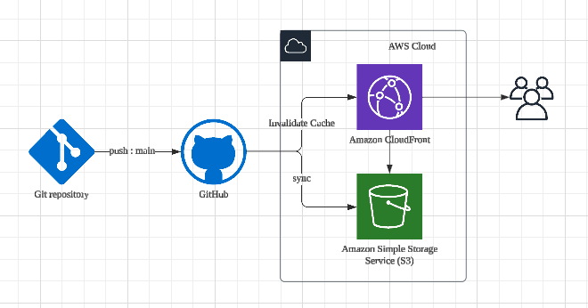
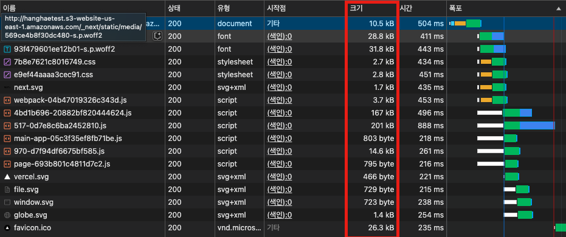
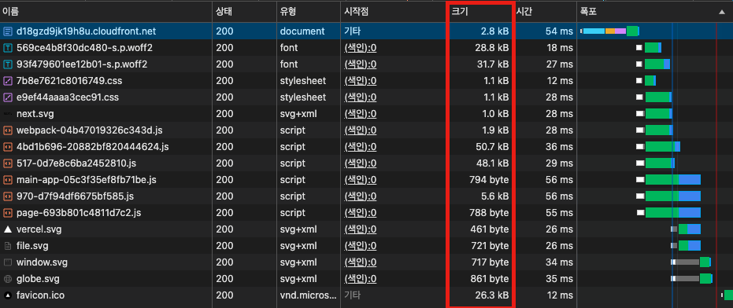
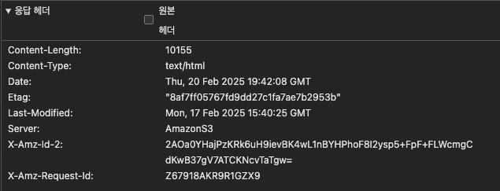
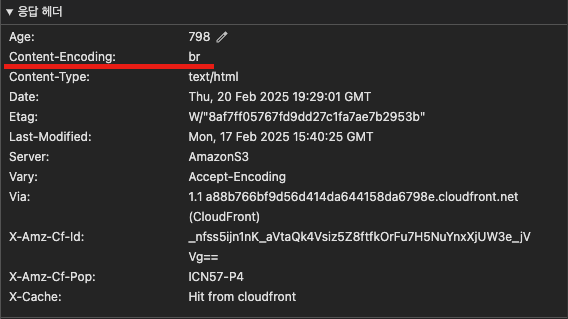

# 항해플러스 4주차 과제 ( 성능 최적화 )

## 주요 링크

1. S3 배포: http://hanghaetest.s3-website-us-east-1.amazonaws.com
2. S3 배포 분석: https://d18gzd9jk19h8u.cloudfront.net/s3-analyze
3. CloudFront 배포: https://d18gzd9jk19h8u.cloudfront.net
4. CloudFront 배포 분석: https://d18gzd9jk19h8u.cloudfront.net/cloudfront-analyze

## 주요 개념

- GitHub Actions과 CI/CD 도구:

> 코드 변경 시 자동 빌드, 테스트, 배포를 실행하는 도구입니다. 예를 들어 GitHub Actions, CircleCI 등이 있으며, 이를 통해 지속적 통합(CI)과 지속적 배포(CD)를 자동화할 수 있습니다.

- S3와 스토리지:

> AWS S3는 확장성이 뛰어난 객체 스토리지 서비스로, 정적 파일(HTML, CSS, JS, 이미지 등)을 안전하게 저장하고 웹사이트 호스팅에 활용할 수 있습니다.

- CloudFront와 CDN:

> AWS CloudFront는 전 세계 엣지 서버를 통해 콘텐츠를 캐시하고 제공하는 CDN(콘텐츠 전송 네트워크) 서비스로, 사용자에게 더 빠른 응답을 제공합니다.

- 캐시 무효화(Cache Invalidation):

> CDN에 캐시된 콘텐츠가 업데이트될 경우, 기존 캐시를 삭제하거나 새로 갱신하는 작업입니다. 이를 통해 항상 최신 콘텐츠가 사용자에게 전달됩니다.

- Repository secret과 환경변수:

> 민감한 정보를 저장소에 노출하지 않기 위해 GitHub와 같은 플랫폼에서 관리하는 비밀 변수들로, CI/CD 파이프라인에서 안전하게 사용할 수 있습니다.

## 배포 flowchart



## 배포 스크립트

1. 트리거 (on)

```yaml
on:
  push:
    branches:
      - main
  workflow_dispatch:
```

- push 이벤트가 발생하면, 즉 메인 브랜치(main)에 코드가 푸시될 때 자동으로 실행됩니다.
- workflow_dispatch 옵션을 추가하여 GitHub Actions에서 수동으로 실행할 수도 있습니다.

2. 작업 (jobs)

```yaml
jobs:
  deploy:
    runs-on: ubuntu-latest
```

- deploy라는 작업(Job)을 정의하며, Ubuntu 최신 버전의 가상 머신에서 실행됩니다.

3. 저장소 체크아웃

```yaml
- name: Checkout repository
  uses: actions/checkout@v4
```

- actions/checkout@v4를 사용하여 GitHub 저장소의 코드를 가져옵니다.
- 이를 통해 main 브랜치의 최신 코드가 작업 환경에 복사됩니다.

4. 프로젝트 의존성 설치

```yaml
- name: Install dependencies
  run: npm ci
```

- npm ci 명령을 사용하여 package.json에 정의된 의존성을 설치합니다.
- npm install 대신 npm ci를 사용하면 패키지 잠금 파일(package-lock.json)에 맞춰 설치되므로 더 신뢰성이 높고 빠릅니다.

5. 프로젝트 빌드

```yaml
- name: Build
  run: npm run build
```

- npm run build를 실행하여 Next.js 프로젝트를 정적 파일로 변환합니다.

6. AWS 자격 증명 설정

```yaml
- name: Configure AWS credentials
  uses: aws-actions/configure-aws-credentials@v1
  with:
    aws-access-key-id: ${{ secrets.AWS_ACCESS_KEY_ID }}
    aws-secret-access-key: ${{ secrets.AWS_SECRET_ACCESS_KEY }}
    aws-region: ${{ secrets.AWS_REGION }}
```

- AWS CLI 명령어를 실행하기 위해 AWS 자격 증명을 설정합니다.
- GitHub Actions의 Secrets에 저장된 AWS 인증 정보를 사용하여 안전하게 설정됩니다.

7. S3 버킷에 배포

```yaml
- name: Deploy to S3
  run: |
    aws s3 sync out/ s3://${{ secrets.S3_BUCKET_NAME }} --delete
```

- aws s3 sync 명령어를 사용하여 빌드된 정적 파일(out/)을 S3 버킷에 업로드합니다.
- -delete 옵션은 S3에서 로컬에 없는 파일을 삭제하여 동기화 상태를 유지합니다.

8. CloudFront 캐시 무효화

```yaml
- name: Invalidate CloudFront cache
  run: |
    aws cloudfront create-invalidation --distribution-id ${{ secrets.CLOUDFRONT_DISTRIBUTION_ID }} --paths "/*"
```

- aws cloudfront create-invalidation 명령어를 실행하여 CloudFront의 캐시를 무효화합니다.
- --paths "/\*" 옵션을 사용하여 모든 파일을 대상으로 캐시 삭제를 수행합니다.
- 이를 통해 배포된 최신 파일이 즉시 반영됩니다.

## CDN과 성능최적화

### 네트워크 탭 비교

- s3

  

- cloudfront

  

> 네트워크 탭을 통해 확인해보면, S3에 배포된 사이트의 자원 크기가 상대적으로 더 큰 것으로 나타납니다.

- s3

  

- cloudfront

  

> 자원들의 응답 헤더를 확인해보면, CloudFront 응답 헤더에 content-Encoding이 포함되어 있음을 알 수 있으며, 이는 자원들이 압축되어 전송되고 있음을 의미합니다.

### CDN 도입 전후 성능 비교

아래 표는 S3 단독 배포와 CloudFront + S3 배포 시의 성능 지표를 sitespeed.io 테스트 결과를 바탕으로 비교한 내용입니다.

| **Metric**                    | **S3 단독 배포** (전) | **CloudFront + S3 배포** (후) |
| ----------------------------- | --------------------- | ----------------------------- |
| **Time to First Byte (TTFB)** | 2.740 s (평균)        | 57 ms (평균)                  |
| **First Contentful Paint**    | 3.269 s (평균)        | 136 ms (평균)                 |
| **Load Event End**            | 4.122 s (평균)        | 128 ms (평균)                 |
| **Server Response Time**      | 233 ms (평균)         | 13 ms (평균)                  |
| **Total Requests**            | 19 요청               | 17 요청                       |
| **Total Transfer Size**       | 약 478.4 KB           | 약 198.7 KB                   |

## 분석

- 응답 속도 개선:

> CloudFront를 도입함으로써 TTFB가 2.740 s에서 57 ms로 크게 단축되었습니다. 이는 엣지 캐싱 덕분에 사용자에게 더 가까운 위치에서 콘텐츠를 제공하기 때문입니다.

- 렌더링 속도 향상:

> First Contentful Paint가 S3 단독 배포에서는 약 3.269 s로 나타났던 반면, CloudFront 도입 후 136 ms로 훨씬 빠르게 초기 콘텐츠가 렌더링됩니다.

- 데이터 전송 최적화:

> CloudFront는 캐시 및 압축 최적화를 통해 전송되는 데이터 크기를 줄여, 네트워크 부하와 비용을 절감합니다. 실제로 전송 데이터가 약 478.4 KB에서 198.7 KB로 감소하였습니다.

- 요청 수 감소:

> 불필요한 요청이 줄어들어 요청 수도 약간 감소(19 → 17)하였으며, 이는 최적화된 네트워크 아키텍처의 결과로 볼 수 있습니다.
